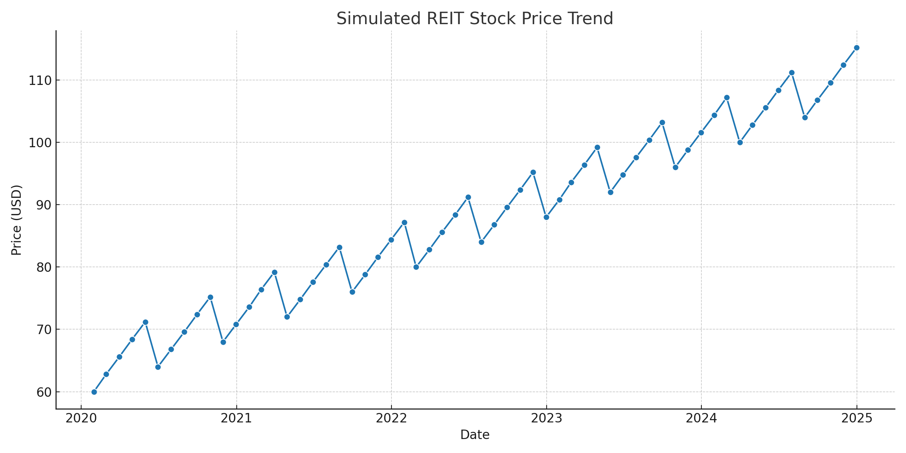

# REIT Valuation & Analysis Tool

This is a Python-based tool to evaluate Real Estate Investment Trusts (REITs) using automated financial data extraction, DCF valuation, and trend visualization.

## Features:
- Fetches REIT financials using `yfinance`
- Calculates key metrics like FFO, Dividend Yield
- Performs DCF valuation with terminal value
- Runs scenario analysis (sensitivity across discount/growth rates)
- Visualizes price and fundamentals using `seaborn`

## Tech Stack:
- Python
- Libraries: pandas, yfinance, seaborn, matplotlib, numpy


## Sample Outputs:

**Stock Price Trend (simulated)**  
Visualizes REIT stock price movement over 5 years using matplotlib and seaborn.




## How to Run:
```bash
pip install -r requirements.txt
python reit_valuation.py
